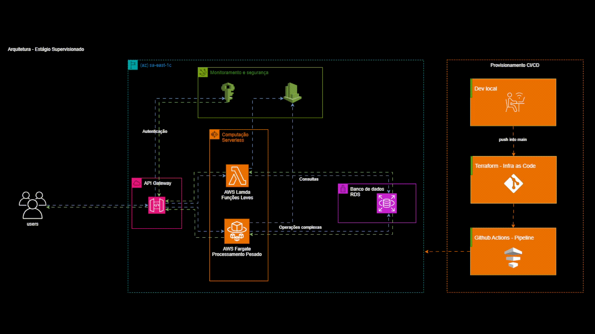

# 📚 Documentação do Sistema de Gerenciamento de Pedidos

## 🎯 Visão Geral

Este sistema implementa uma API completa de gerenciamento de pedidos usando uma arquitetura de microserviços na AWS. A infraestrutura é definida como código utilizando Terraform/OpenTofu, seguindo as melhores práticas de IaC (Infrastructure as Code).

## 🏗️ Arquitetura Geral



O sistema utiliza uma abordagem híbrida, combinando diferentes tecnologias AWS para otimizar performance e custos:

- **Operações de Leitura (GET/DELETE)**: Implementadas com AWS Lambda para alta performance e baixo custo
- **Operações de Escrita (POST/PUT)**: Implementadas com ECS Fargate para maior flexibilidade e controle
- **Ponto de Entrada Único**: API Gateway gerencia todo o roteamento
- **Armazenamento**: DynamoDB para escalabilidade e performance
- **Observabilidade**: CloudWatch para logs e monitoramento

## 📋 Índice da Documentação dos Módulos

### ⚡ **[Lambda Functions](documentation/obsidian_doc/lamda.md)**
**Funções serverless para operações de leitura e exclusão**

O módulo responsável por:
- Implementação de funções GET e DELETE para pedidos
- Configuração de runtime Node.js otimizado
- Integração direta com DynamoDB via IAM Roles
- Gerenciamento de permissões e políticas de segurança

**Principais recursos:**
- Execução serverless com cold start otimizado
- Acesso direto ao DynamoDB com least privilege
- Logs automáticos no CloudWatch
- Configuração de timeout e memória por função

---

### 🐳 **[Fargate](documentation/obsidian_doc/fargate.md)**
**Containers serverless para operações de escrita complexas**

O módulo responsável por:
- Orquestração de containers para POST e PUT
- Configuração de ECS Cluster e Services
- Network Load Balancer para alta disponibilidade
- Auto-scaling baseado em métricas de CPU e memória

**Principais recursos:**
- Containers isolados em rede privada
- Health checks e restart automático
- Configuração mínima de recursos (256 CPU, 512MB RAM)
- Exposição via NLB para integração com API Gateway

### 🚪 **[API Gateway](documentation/obsidian_doc/apigateway.md)**
**Ponto de entrada único para todas as requisições**

O módulo responsável por:
- Roteamento inteligente de requisições HTTP
- Integração com Lambda Functions (GET/DELETE)
- Integração com Fargate via VPC Link (POST/PUT)
- Gerenciamento de autenticação e autorização
- Configuração de respostas e códigos de status

**Principais recursos:**
- 4 endpoints REST completos
- Integração AWS_PROXY para Lambda
- Integração HTTP para Fargate
- VPC Link para conectividade segura

---

### 🗄️ **[DynamoDB](documentation/obsidian_doc/dynamodb.md)**
**Banco de dados NoSQL para armazenamento dos pedidos**

O módulo responsável por:
- Criação e configuração da tabela de pedidos
- Configuração de chaves primárias e índices
- Otimização de custos com modo PAY_PER_REQUEST
- Integração com permissões IAM

**Principais recursos:**
- Esquema flexível (schema-less)
- Escalabilidade automática
- Integração nativa com Lambda e Fargate
- Configuração de tags para organização

---

### 📊 **[CloudWatch](documentation/obsidian_doc/cloudwatch.md)**
**Sistema completo de monitoramento e observabilidade**

O módulo responsável por:
- Configuração de grupos de logs para todos os serviços
- Criação de alarmes para detecção de problemas
- Dashboards para visualização de métricas
- Otimização de custos com retenção configurável

**Principais recursos:**
- Logs centralizados de API Gateway, Lambda e Fargate
- Alarmes configuráveis para erros 5XX
- Dashboard unificado com métricas essenciais
- Configuração flexível por ambiente

---

## 🔗 Interconexão dos Módulos

### **Fluxo de Dependências**
```
graph TD
    A[DynamoDB] --> B[Lambda Functions]
    A --> C[Fargate Services]
    B --> D[API Gateway]
    C --> E[Network Load Balancer]
    E --> D
    D --> F[CloudWatch]
    B --> F
    C --> F
```


### **Matriz de Integração**

| Módulo | DynamoDB | API Gateway | CloudWatch | Dependências |
|--------|----------|------------|------------|--------------|
| **DynamoDB** | - | ❌ | ✅ | Nenhuma |
| **API Gateway** | ❌ | - | ✅ | Lambda, Fargate |
| **CloudWatch** | ❌ | ✅ | - | Todos os módulos |

## 📊 Visão de Operações por Módulo

### **Operações CRUD Distribuídas**

| Operação | Endpoint | Módulo Principal | Módulo Secundário | Armazenamento |
|----------|----------|------------------|-------------------|---------------|
| **CREATE** | `POST /pedido` | API Gateway → Fargate | - | DynamoDB |
| **READ** | `GET /pedido/{id}` | API Gateway → Lambda | - | DynamoDB |
| **UPDATE** | `PUT /pedido/{id}` | API Gateway → Fargate | - | DynamoDB |
| **DELETE** | `DELETE /pedido/{id}` | API Gateway → Lambda | - | DynamoDB |

## 🛠️ Configuração e Implantação

### **1. Pré-requisitos**
- Terraform ou OpenTofu >= 0.12
- AWS CLI configurado
- Permissões IAM adequadas

### **2. Ordem de Implantação**
```shell script
# 1. Módulos base (sem dependências)
terraform apply -target=module.dynamodb_pedidos

# 2. Módulos de aplicação
terraform apply -target=module.lambda_get_pedido
terraform apply -target=module.lambda_delete_pedido
terraform apply -target=module.fargate_post_pedido

# 3. Módulo de roteamento
terraform apply -target=module.api_gateway

# 4. Módulo de observabilidade
terraform apply -target=module.cloudwatch

# 5. Aplicação completa
terraform apply
```


## 💰 Análise de Custos por Módulo

### **Estimativa Mensal (Ambiente de Desenvolvimento)**

| Módulo | Componente | Custo Estimado | Otimizações |
|--------|------------|----------------|-------------|
| **DynamoDB** | Tabela + Operações | ~$0.54 | PAY_PER_REQUEST |
| **API Gateway** | Requisições | ~$0.11 | Baixo volume |
| **CloudWatch** | Logs + Métricas | ~$0.54 | Retenção 3 dias |
| **Lambda** | Execuções | ~$0.05 | Tier gratuito |
| **Fargate** | vCPU + Memória | ~$15.00 | Configuração mínima |
| **Total** | - | **~$16.24/mês** | Ambiente dev |

### **Estratégias de Otimização Implementadas**
- ✅ Retenção de logs mínima (3 dias)
- ✅ Configuração Fargate otimizada
- ✅ DynamoDB em modo sob demanda
- ✅ Alarmes e dashboards opcionais
- ✅ Recursos condicionais por ambiente

## 🔐 Considerações de Segurança

### **Segurança por Módulo**

| Módulo | Implementação de Segurança | Status |
|--------|----------------------------|---------|
| **DynamoDB** | IAM Policies específicas | ✅ Implementado |
| **API Gateway** | Autenticação (NONE em dev) | ⚠️ Requer atenção em produção |
| **CloudWatch** | Logs isolados por serviço | ✅ Implementado |
| **VPC Link** | Conectividade privada | ✅ Implementado |

### **Melhorias Recomendadas para Produção**
- 🔒 Implementar autenticação no API Gateway
- 🔒 Configurar WAF para proteção adicional
- 🔒 Implementar VPC endpoints para DynamoDB
- 🔒 Configurar encryption em repouso

## 📈 Escalabilidade e Performance

### **Características de Escalabilidade**

| Componente | Tipo de Scaling | Limites | Performance |
|------------|----------------|---------|-------------|
| **API Gateway** | Automático | 10.000 req/s | < 50ms latência |
| **Lambda** | Automático | 1000 execuções concorrentes | < 100ms cold start |
| **Fargate** | Manual/Auto | Configurável | Dependente da aplicação |
| **DynamoDB** | Automático | Ilimitado | < 10ms latência |

## 🎯 Próximos Passos

### **Melhorias Planejadas**
1. **Segurança**: Implementar autenticação robusta
2. **Monitoramento**: Expandir métricas e alarmes
3. **Performance**: Implementar caching
4. **Resiliência**: Adicionar circuit breakers
5. **Teste**: Implementar testes automatizados

### **Documentação Adicional**
- [Guia de Troubleshooting](troubleshooting.md)
- [Playbooks de Operação](operations.md)
- [Guia de Contribuição](contributing.md)
- [Changelog](changelog.md)

---

## 📞 Suporte e Contribuição

Para dúvidas, problemas ou contribuições:

1. **Issues**: Use o sistema de issues do repositório
2. **Pull Requests**: Siga o guia de contribuição
3. **Documentação**: Mantenha sempre atualizada
4. **Testes**: Inclua testes para novas funcionalidades

---

**🏷️ Tags:** `aws` `terraform` `api-gateway` `lambda` `fargate` `dynamodb` `cloudwatch` `microservices` `iac` `pedidos`